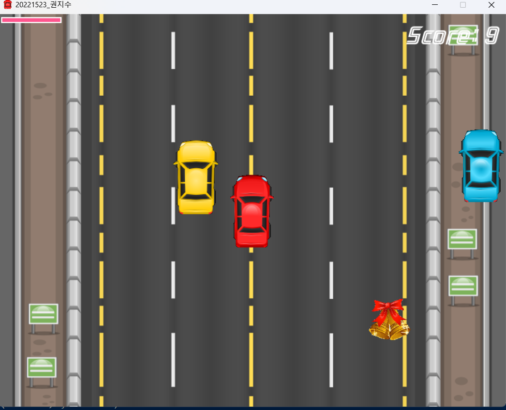

MAS2011-project
=============
### Car Racing Game🚗

* Trailer video
  
  <https://youtu.be/rFZftg-mF6I>

* Playing image (completed version)
  
  </img>
  </img>

* Completed version

    You can see all images, sounds, code, etc. in this(master) branch.

#### How to play🤔

</img>

    You can move the car using the arrow keys. Upkey speeds up the speed, and downkey slows it down. It can also move left and right.

</img>
</img>
</img>

    The red car is the player car. When the shield score in the upper left reaches 0, the game ends and returns to the main screen.

#### Item🎄
1.</img>

Score increases by 50 points.

2.</img>

The speed of the obstructed car decreases.

3.</img>

Shield score increases by 30 points.

4.</img>

Shield score increases by 10 points.

